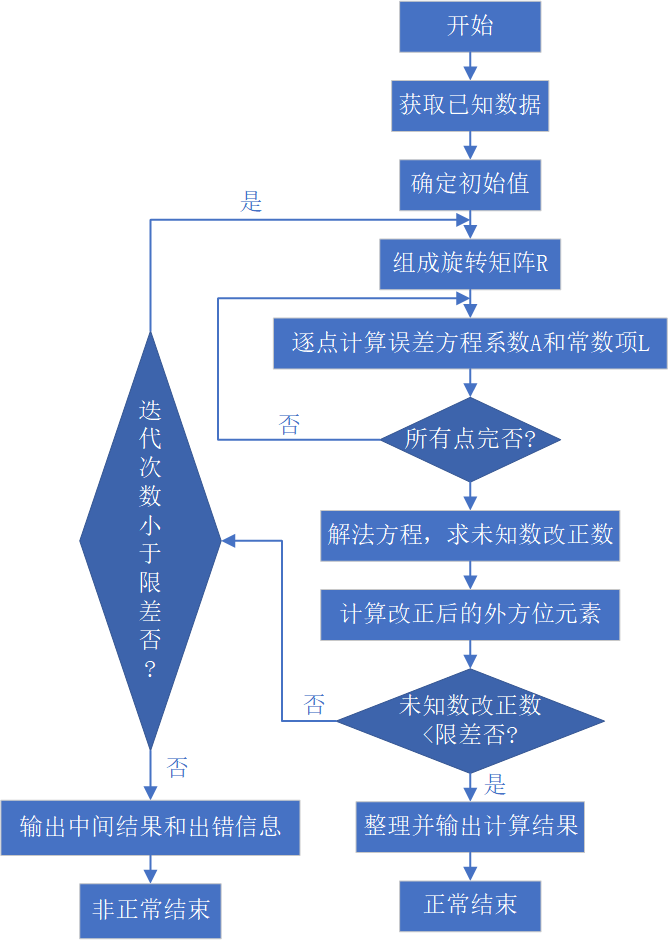
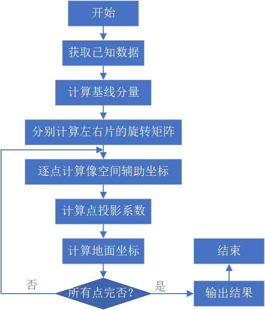
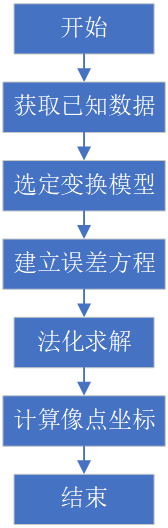
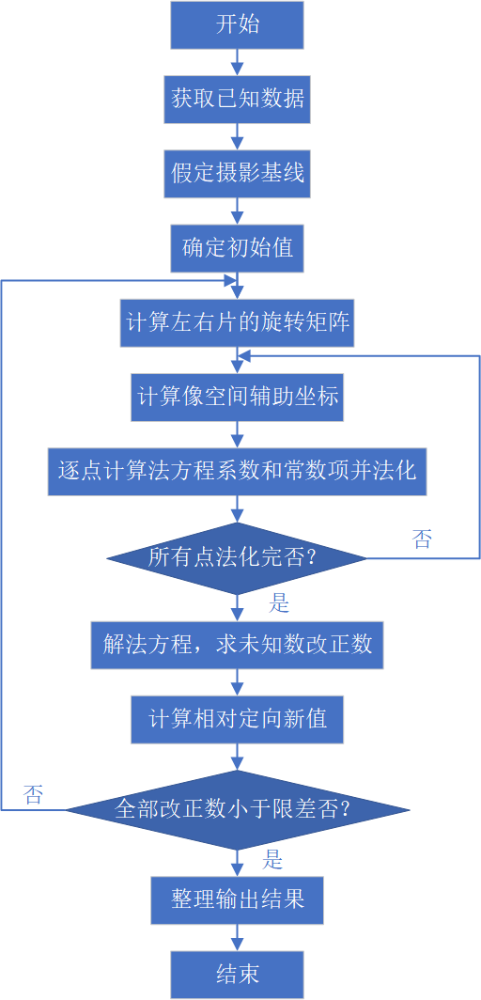
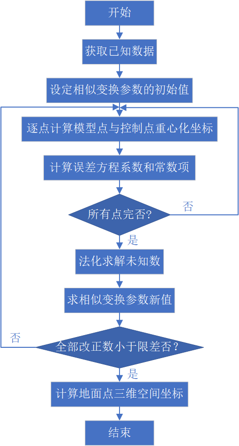

# 解析摄影测量实习
## 空间后方交会
利用影响覆盖范围内一定数量的控制点的空间坐标与影响坐标，基于共线方程，反求该影像的的六个外方位元素： $X_S$, $Y_S$, $Z_S$, $\varphi$, $\omega$, $\kappa$ 

## 空间前方交会
利用点投影系数法根据两张像片的外方位元素计算模型点坐标。

## 解析内定向
扫描坐标转为相片坐标。

## 相对定向
恢复两张像片间的相互关系，构建立体模型。

## 绝对定向
将相对定向的模型用控制点纳入大地测量坐标系中，恢复模型的绝对位置。

